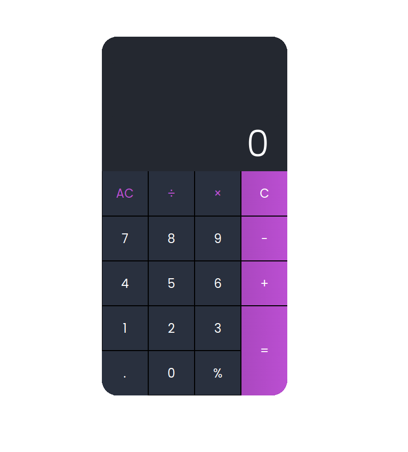
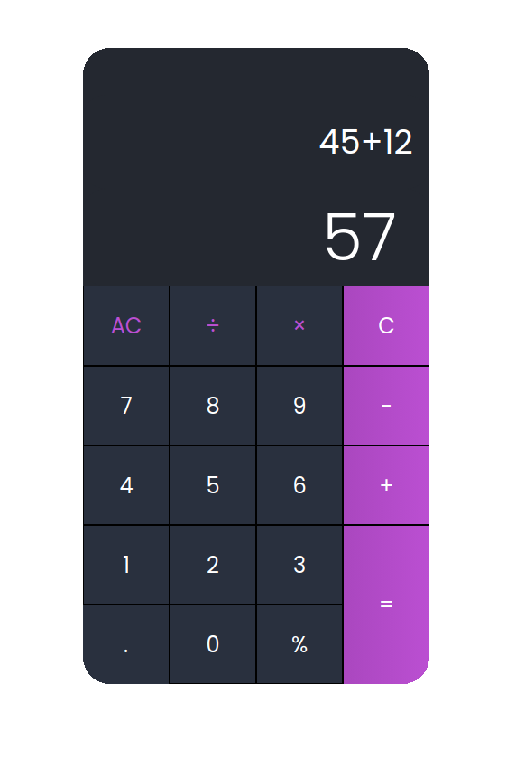

# CalculatorJs

## Description

This is a simple calculator made with JavaScript, HTML and CSS. It was made to practice my skills with JavaScript and DOM manipulation.  Also, I used the [mathjs](https://mathjs.org/) library to evaluate the expressions. The calculator has a dark mode and a light mode. 

---
## How to use

Just open the index.html file in your browser and you're good to go.

---
## How to contribute

1. Fork this repository
2. Clone it to your local machine
3. Create a new branch for your feature
4. Commit your changes
5. Push your changes to your fork    

---
## Images 

---

---

## License

This project is under the MIT license. See the [LICENSE](LICENSE.md) file for more details.
    

